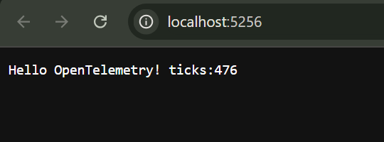
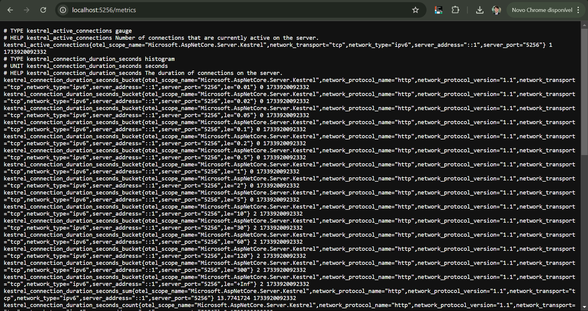
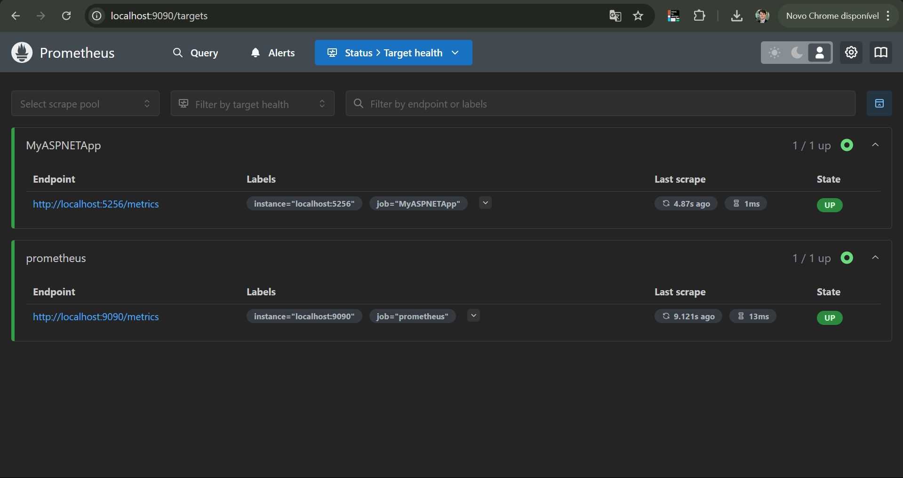
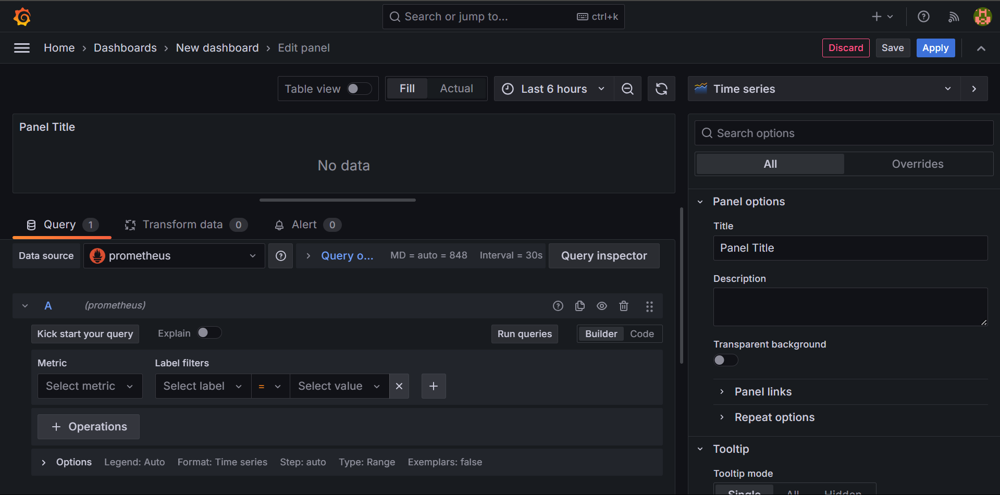
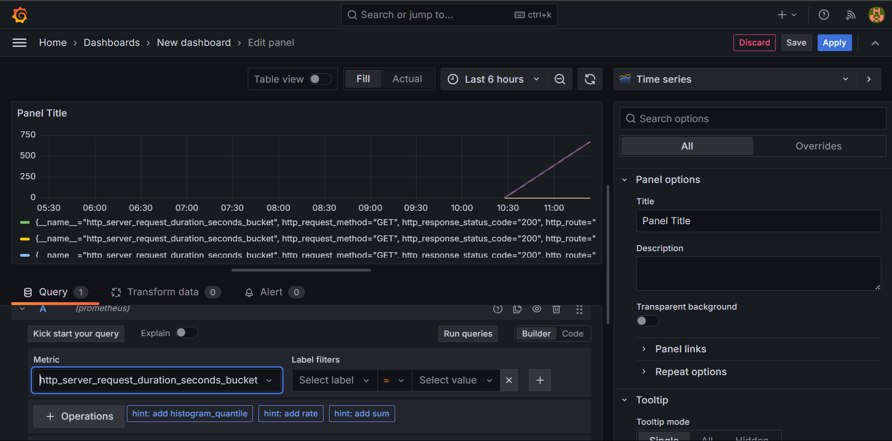
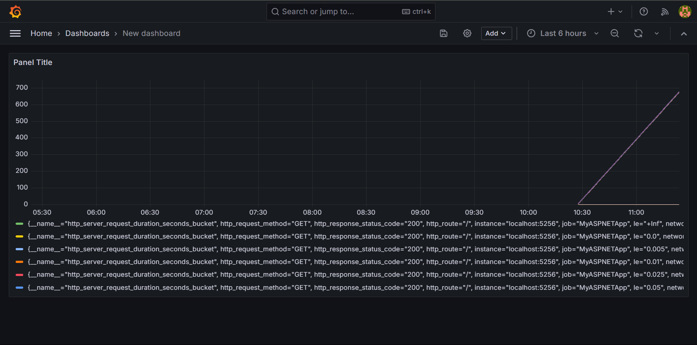
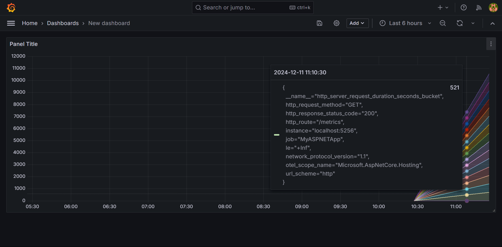

# Coleta de Métricas com [ASP.NET](http://asp.net/) Core, Prometheus e Grafana [Luis Miranda]

Este repositório documenta o passo a passo para configurar e visualizar métricas de um aplicativo [ASP.NET](http://asp.net/) Core utilizando Prometheus e Grafana. 

## Estrutura do Repositório

```
|-- WebMetric/       # Código-fonte do aplicativo ASP.NET Core
|-- Prometheus/      # Configuração do Prometheus
|-- Grafana/         # Configuração do Grafana
|-- assets/          # Capturas de tela utilizadas no README
|-- README.md        # Documentação do projeto

```

## Passo a Passo

### **1. Configurar o Aplicativo [ASP.NET](http://asp.net/) Core**

### Criar o Aplicativo

1. Execute os seguintes comandos no terminal:
    
    ```bash
    dotnet new web -o WebMetric
    cd WebMetric
    dotnet add package OpenTelemetry.Exporter.Prometheus.AspNetCore --prerelease
    dotnet add package OpenTelemetry.Extensions.Hosting
    
    ```
    
2. Substitua o conteúdo de `Program.cs` pelo código abaixo:
    
    ```csharp
    using OpenTelemetry.Metrics;
    
    var builder = WebApplication.CreateBuilder(args);
    builder.Services.AddOpenTelemetry()
        .WithMetrics(builder =>
        {
            builder.AddPrometheusExporter();
            builder.AddMeter("Microsoft.AspNetCore.Hosting",
                             "Microsoft.AspNetCore.Server.Kestrel");
            builder.AddView("http.server.request.duration",
                new ExplicitBucketHistogramConfiguration
                {
                    Boundaries = new double[] { 0, 0.005, 0.01, 0.025, 0.05,
                                               0.075, 0.1, 0.25, 0.5, 0.75, 1, 2.5, 5, 7.5, 10 }
                });
        });
    var app = builder.Build();
    
    app.MapPrometheusScrapingEndpoint();
    
    app.MapGet("/", () => "Hello OpenTelemetry! ticks:" + DateTime.Now.Ticks.ToString()[^3..]);
    
    app.Run();
    
    ```
    
3. Execute o aplicativo:
    
    ```bash
    dotnet run
    
    ```
    
4. Acesse o endpoint principal:**Exemplo:**
    
    ```
    <http://localhost:5256>
    
    ```
    
    
    
5. Acesse as métricas expostas:**Exemplo:**
    
    ```
    <http://localhost:5256/metrics>
    
    ```
    
    
    

### **2. Configurar o Prometheus**

### Baixar o Prometheus

1. Acesse https://prometheus.io/download/ e baixe a versão para Windows.
2. Extraia o conteúdo em uma pasta chamada `Prometheus`.

### Configurar o `prometheus.yml`

1. Crie ou edite o arquivo `prometheus.yml` na pasta do Prometheus com o seguinte conteúdo:
    
    ```yaml
    global:
      scrape_interval: 15s
    
    scrape_configs:
      - job_name: 'prometheus'
        static_configs:
          - targets: ['localhost:9090']
    
      - job_name: 'MyASPNETApp'
        static_configs:
          - targets: ['localhost:5256']
    
    ```
    

### Executar o Prometheus

1. Navegue até a pasta do Prometheus e execute o comando:
    
    ```bash
    prometheus.exe --config.file=prometheus.yml
    
    ```
    
2. Acesse o Prometheus em:
    
    ```
    <http://localhost:9090>
    
    ```
    
3. Verifique os targets em **Status > Targets**:
**Exemplo:**
    
    
    

### **3. Configurar o Grafana**

### Instalar o Grafana

1. Baixe o Grafana em https://grafana.com/grafana/download.
2. Instale o Grafana e inicie o serviço:
    
    ```bash
    net start grafana
    
    ```
    
3. Acesse o Grafana em:
    
    ```
    <http://localhost:3000>
    
    ```
    
4. Login padrão:
    - Usuário: `admin`
    - Senha: `admin` ou `samsung1` (pois redefini rs)

### Configurar o Prometheus como Fonte de Dados

1. No Grafana, clique em **Configuration > Data Sources**.
2. Adicione uma nova fonte de dados e selecione **Prometheus**.
3. Configure o URL como `http://localhost:9090` e salve.

### **4. Criar um Dashboard no Grafana**

### Adicionar um Painel

1. Clique em **Create > Dashboard** e em seguida **Add New Panel**.
2. Configure a query:
    
    ```
    http_server_request_duration_seconds_bucket
    
    ```
    
3. Adicione filtros se necessário, como:**Exemplo:**
    
    ```
    http_server_request_duration_seconds_bucket{http_request_method="GET", http_response_status_code="200"}
    
    ```
    
    
    

### Visualizar o Gráfico

1. Ajuste o intervalo de tempo para **Last 6 hours**.
2. Clique em **Apply** para salvar o painel.
**Exemplo:**
    
    

## Gráficos em Funcionamento

1. Este é um exemplo de visualização do painel configurado:
**Exemplo:**
    
    
    
2. Outra visualização mostrando mais detalhes:
**Exemplo:**
    
    

## Considerações Finais

Este tutorial fornece um guia prático para monitorar métricas em um aplicativo [ASP.NET](http://asp.net/) Core usando Prometheus e Grafana.
